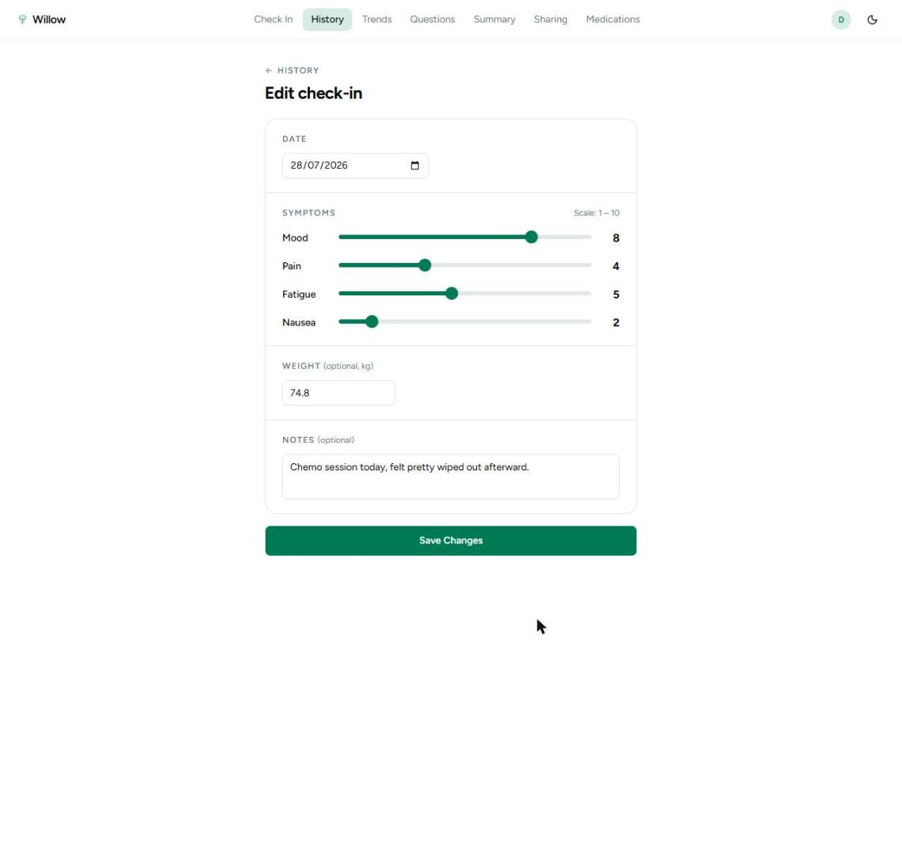
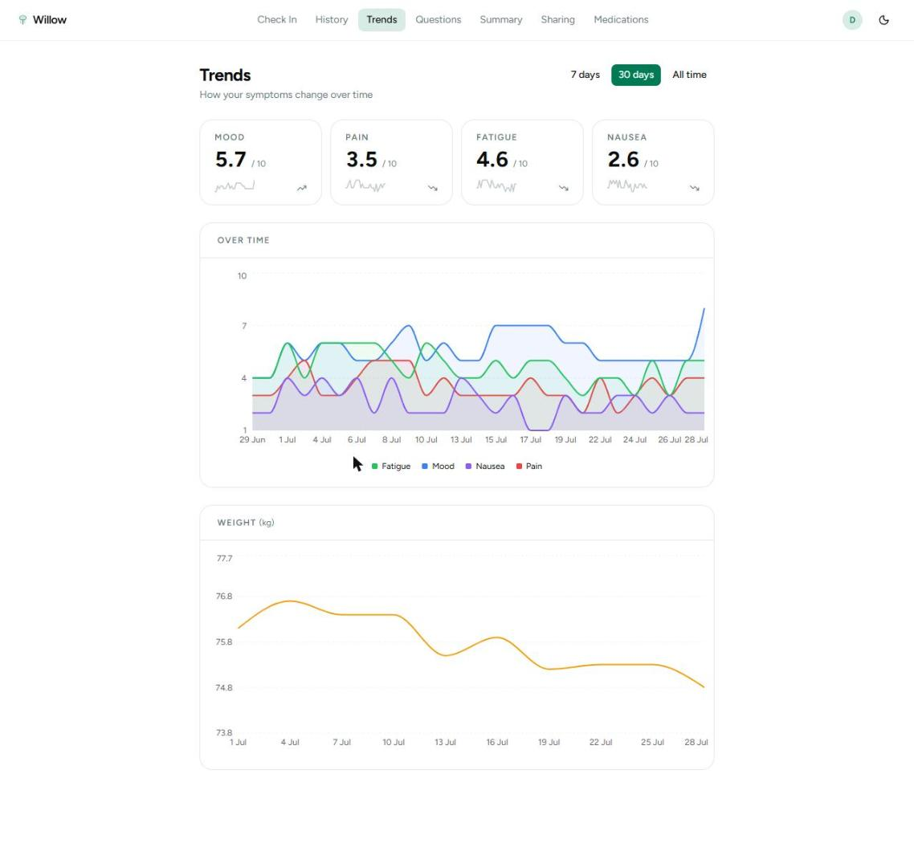
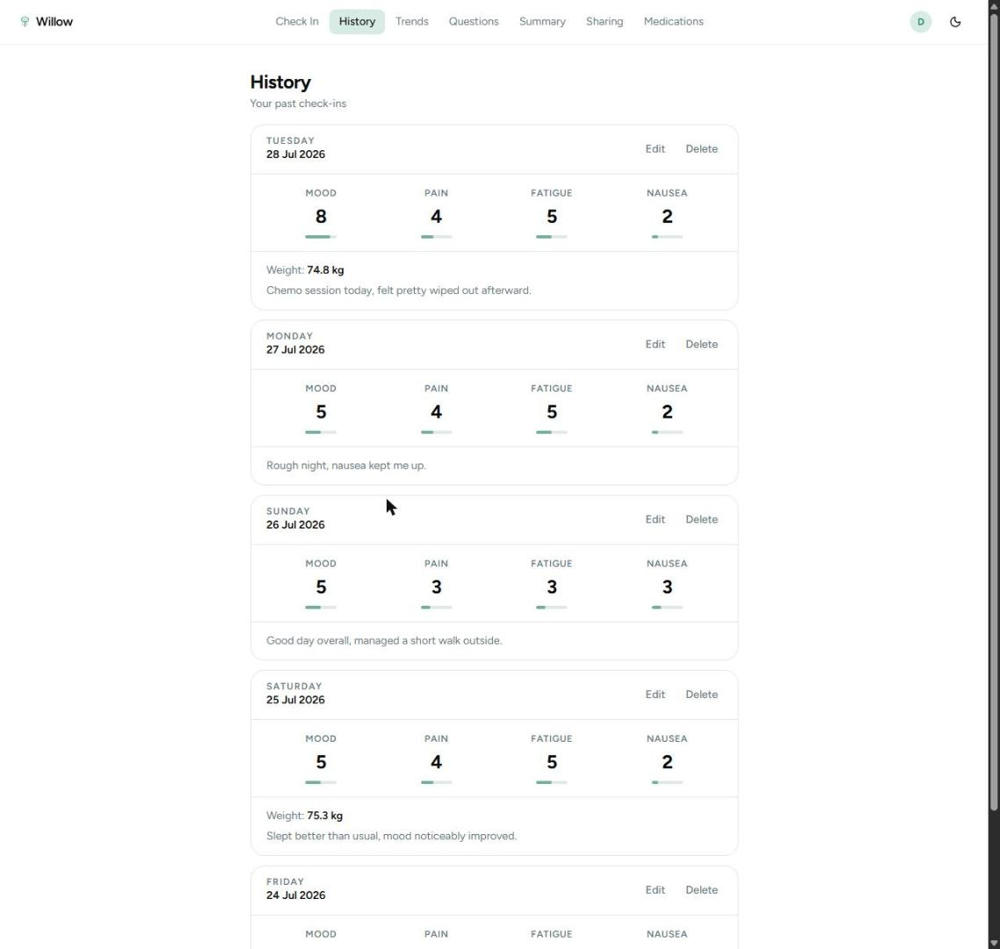
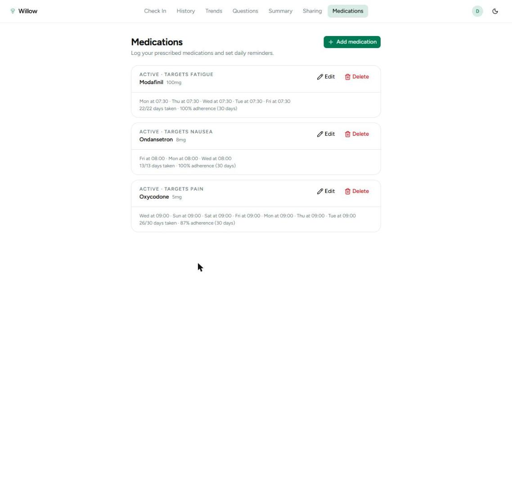
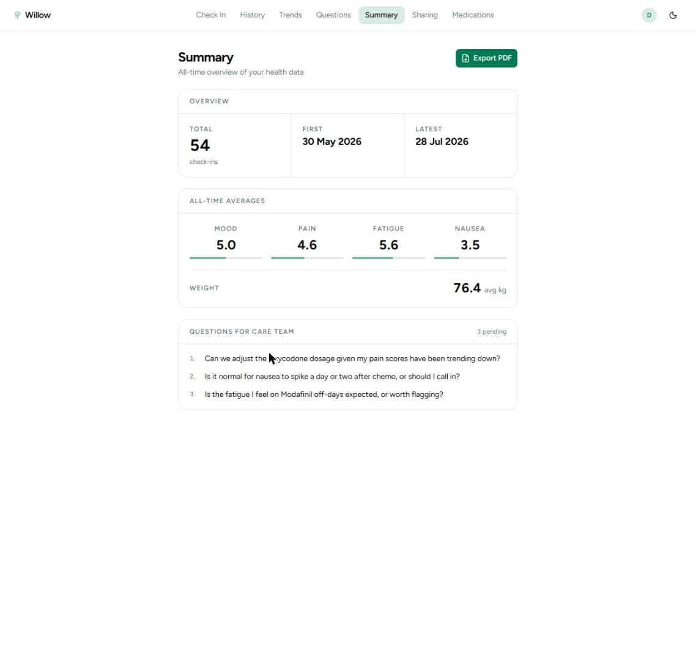
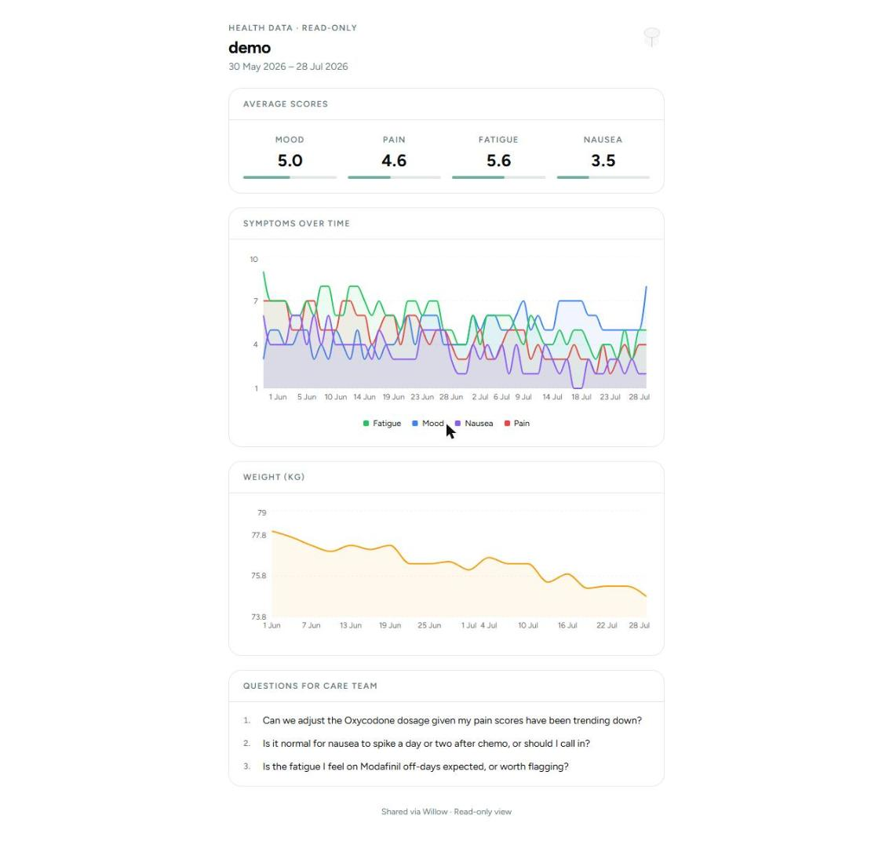

# Willow

A symptom tracker for people going through cancer treatment.

Treatment days blur together. By the time you're back in front of your care team, it's hard to remember whether the nausea was worse on Tuesday or Thursday, or which day the fatigue really hit. Willow is a quiet daily check-in: rate how you're doing, jot a note, and keep a running list of questions to bring to your next appointment. Over time it turns scattered days into something you can actually look at — and hand to your doctor.

It's a full-stack app: a .NET 10 API backed by Azure SQL, and a React 19 single-page frontend — deployed on Azure (Static Web Apps + App Service).

🔗 **Live:** [willow-health.pro](https://willow-health.pro)

---

## Screenshots

| | |
|---|---|
|  |  |
|  |  |
|  |  |

---

## What it does

- **Daily check-ins** — mood, pain, fatigue, and nausea on a 1–10 scale, plus optional weight and free-text notes. One entry per day.
- **Trends** — charts so you can see how things move week to week instead of guessing from memory.
- **History** — every past check-in, editable after the fact.
- **Medications** — track prescriptions with weekly schedules, log daily adherence, and see a 30-day adherence rate per medication.
- **Questions for the care team** — a simple running list so nothing gets forgotten in the appointment, with AI-suggested questions based on recent symptoms.
- **Doctor-ready summary** — stats over a date range, exportable to PDF to bring along or email.
- **Read-only share links** — generate an unguessable link so a caregiver or clinician can view your dashboard without an account.
- **Daily check-in reminders** — optional email nudge if you haven't logged a check-in yet today.
- **Real accounts** — email/password registration with email verification, password reset, and JWT-based sessions.

## Built with

**Backend**
- .NET 10 / ASP.NET Core
- Azure SQL Database via Entity Framework Core
- ASP.NET Core Identity + JWT bearer auth (HMAC-SHA512)
- MediatR (CQRS), AutoMapper, FluentValidation
- QuestPDF for the doctor-ready PDF exports
- Resend for transactional email
- Claude (Anthropic API) for AI-suggested care team questions

**Frontend**
- React 19 + TypeScript, built with Vite
- TanStack Query for server state
- React Hook Form + Zod for forms and validation
- React Router v7
- Tailwind CSS v4 + shadcn/ui
- Recharts for the trend charts

**Testing**
- xUnit — unit tests (EF Core InMemory + Moq) and integration tests over real HTTP (`WebApplicationFactory`)
- Vitest + React Testing Library on the frontend

## How it's put together

The backend follows a clean, layered split — the kind of separation that keeps business logic out of controllers and makes the thing testable:

```
Domain        →  plain C# entities (CheckIn, AppUser), no dependencies
Persistence   →  EF Core, the DbContext, migrations
Application   →  all business logic — one file per operation (Query/Command + Handler)
API           →  thin ASP.NET controllers that just dispatch to MediatR
```

A few decisions worth calling out:

- **CQRS with MediatR.** Every operation is its own request/handler pair, so each slice of behavior lives in one place and is trivial to test in isolation.
- **`Result<T>` everywhere.** Handlers don't throw for expected failures (not found, unauthorized, validation) — they return a result the controller maps to the right HTTP status. Exceptions are for the genuinely exceptional.
- **Validation runs automatically.** A MediatR pipeline behavior runs FluentValidation before any handler is reached, so handlers can assume their input is already clean.
- **Auth is the real thing.** Email verification gates login, password reset works end to end over email, and rate limiting protects the auth endpoints (5 requests / 15 min on login, stricter on forgot-password).

On the frontend, server state is owned entirely by TanStack Query (no hand-rolled loading flags), forms are typed end to end with Zod schemas, and the JWT is attached by an axios interceptor that also catches expired-token 401s and bounces you to login.

## Deployment

Runs on Azure:

- **Frontend** — Azure Static Web Apps, deployed via its own GitHub Actions workflow (PR preview environments included)
- **API** — Azure App Service, running a Docker image built in CI and pushed to Docker Hub
- **Database** — Azure SQL Database

`ci.yml` runs backend and frontend tests in parallel, then deploys the API on a pass to `main`.

## Running it locally

You'll need .NET 10 SDK, Node 20+, and Docker (for SQL Server).

**1. Start the database**

```bash
docker compose up mssql -d
```

**2. Configure the API**

Create `API/appsettings.Development.json` (gitignored):

```json
{
  "ConnectionStrings": { "DefaultConnection": "Server=localhost,1433;Database=willow;User Id=sa;Password=YourStrong!Passw0rd;TrustServerCertificate=true" },
  "Jwt": { "Key": "<a random string of at least 64 characters>" },
  "ClientUrl": "https://localhost:3000",
  "Resend": { "ApiKey": "", "FromEmail": "noreply@willow-health.pro" }
}
```

**3. Run the backend**

```bash
dotnet ef database update -p Persistence -s API   # apply migrations
dotnet run --project API
```

**4. Run the frontend**

```bash
cd client
npm install
npm run dev        # https://localhost:3000
```

## Tests

```bash
# backend
dotnet test

# frontend
cd client
npm run test:run
```

---

Willow is a personal project — built to be genuinely useful, and to be a place to do full-stack .NET and React properly end to end.
